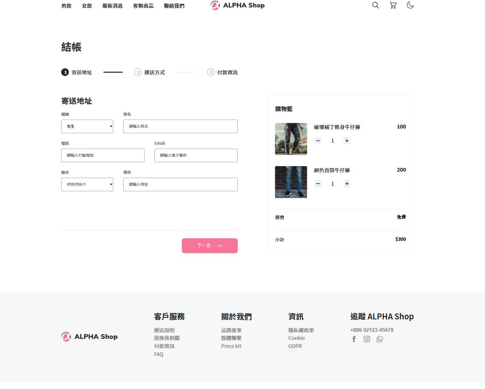

# ✨AlphaShop - React

## 👋 Welcome

這是一份基於 React 框架製作的「結帳畫面」。

## ✨ Features

使用者可以逐步填寫表單，共分為 3 個步驟：寄送地址, 運送方式, 付款資訊

## ✨ Start the project

1.  確認已經安裝 node.js 與 npm
2.  clone 專案
3.  終端機進入資料夾並輸入：`$ npm install `
4.  安裝完畢後，繼續輸入：`$ npm start`
5.  若要暫停使用，可在終端機執行：`ctrl + c`

## ⚠️ Reminder

目前專案僅呈現靜態，若要查看其他表單的渲染結果，可以在 Form 元件內找到其餘表單的子元件做切換。
